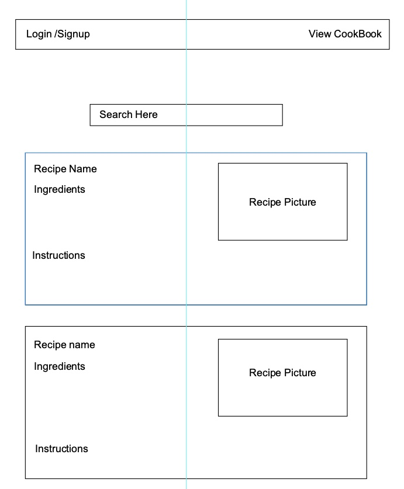
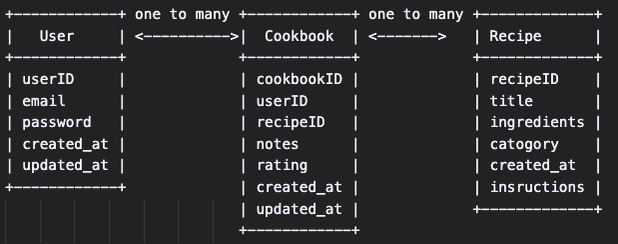

# PalatePages

## Technologies
- React
- Node
- Express
- MondoDB
- Oauth
- Possibly TheMealDB APi

## User Stories
- I want to be able to search for different recipes
- I want to be able to add and delete recipes on to my personal "cookbook"
- I want to be able to signup and login with an account
- I want to be able to view recipe details and instructions

## Wireframes

## ERDs

## Restful routes

## MVP
- Search/Home page
- Cookbook/User home page
- add delete and create sections in cookbook

## Stretch Goals
- Create custom recipes
- Filtered search ( Breakfast, dinner, italian, etc...)
- Nutrition facts
- Categorized cookbook

